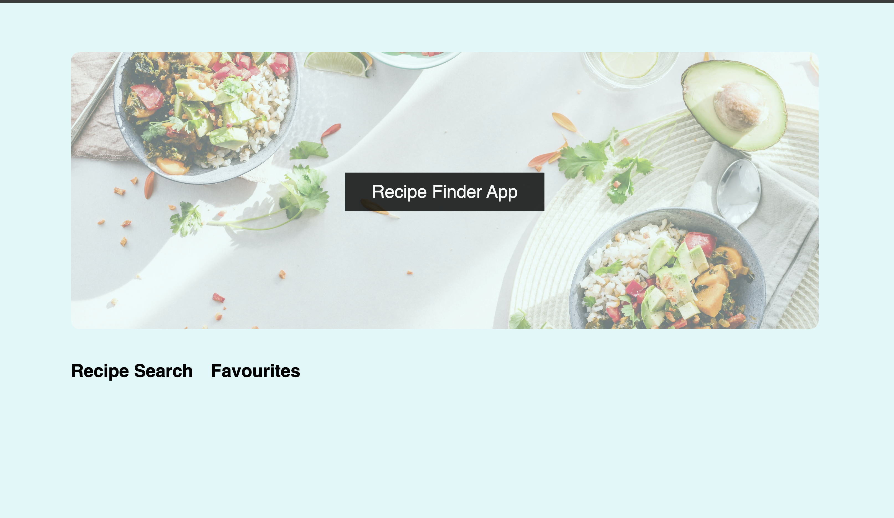
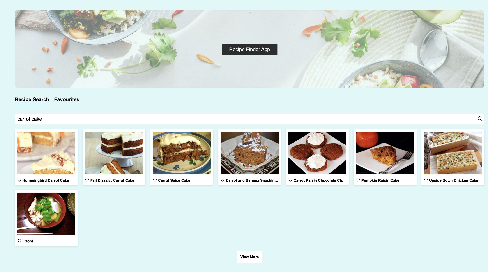
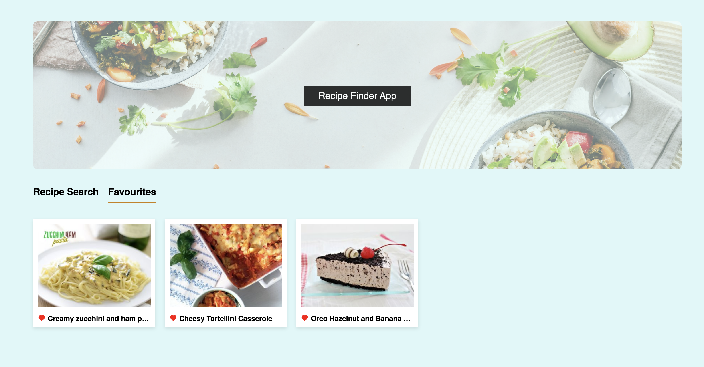

# Recipe Finder App

## Description

This app allows users to view, add and manage their favourite recipes.

This is a fullstack app with a database in the backend that is used to store the users favourite recipes.

It is built using HTML, CSS, and Typescript for the frontend with Node.js and Prisma for the backend.

## How to Use the Project

To use the app you can

1. Clone this repository:

   ```
   git@github.com:mheavey2/recipe-app.git
   ```

2. Navigate to the cloned repository on your device

3. Navigate to the backend and start the backend server

```
cd backend
npm start
```

4. Navigate to the frontend in a new terminal and start the frontend development server

```
cd ../frontend
npm run dev
```

5. Open the localhost specified in the terminal to view the app homepage
6. Click on the Recipe Search tab and search for a recipe (10 results are displayed)



7. To see more results use the 'View More' button at the bottom of the screen



8. To find out more about a recipe, click on the recipe image and an information modal will be displayed


9. To add a recipe to your favourites click on the heart icon under the recipe image (the heart will change from colorless to red)

10. To view your favourite recipes click on the Favourites tab



11. Recipes can be removed fom the favourites by clicking on the heart (the heart will change from red to colourless)

## Future Improvements

Future improvements to the app could include:

- add filtering functionality to filter recipes based on e.g. dish type (lunch/dinner etc), vegetarian,gluten free, popularity, cuisine type (italian/french/chinese, etc)
- add wine pairing feature to show recommended wine pairings with the selected dish
- allow user to download recipe
- allow user to create meal plans
